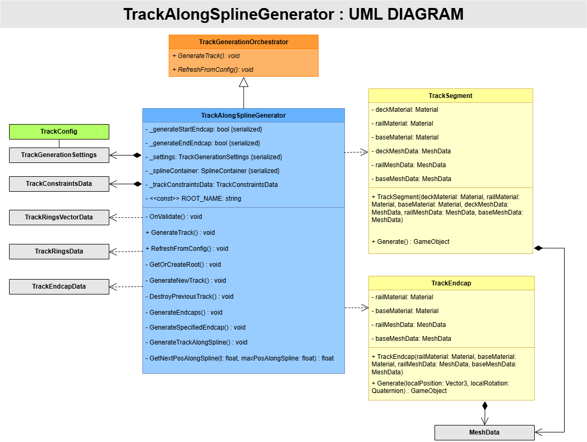

# Unity Custom Track Generation

## Description
This Unity Asset enables seamless custom track generation for users to quickly prototype/create game-ready road surfaces 
for personal projects or commercial games.

Currently, this asset contains one tool **(work in progress)** that utilizes Unity's spline system to create a
track along the user-defined spline. Tracks are generated with optional endcaps at the start and end of the spline. 

The track is generated by procedurally traversing the user-defined spline and sampling the spline's world position,
forward, and up vectors at specified intervals to create rings of vertices corresponding with the orientation of the 
spline at the given point and with dimensions defined either directly by the user or by an optional default ScriptableObject
that stores the default track configuration constraints.

## Features

- **Procedural mesh generation**
- **Spline-based world position, forward, and up vector sampling**
- **Persistent ScriptableObject for global constraints**
- **Modular separation of class responsibilities**

---

## What's Next?
Once *TrackAlongSpline* is complete and polished, similar functionality will be utilized to create 
several additional tools, including:

- Curves
- Loops
- Ramps
- Intersections
- Tunnels
- ... and more

Additionally, all track elements will be capable of snapping together to create smooth, consistent, and modular track construction. 

---

## License
**© 2026 James McAdams — All Rights Reserved.**  
This project is **proprietary** and **not open source**.

You may view this code for evaluation or portfolio-review purposes, but you may **not** copy, modify, use, or distribute any part of it 
without explicit written permission.

---

## Creator
**James McAdams (2026)**

---

## Documentation

### TrackAlongSpline UML Diagram

#### UML Key
- **Blue**   -  Driver Class
- **Green**  -  ScriptableObject
- **Yellow** -  GameObject Creation Class
- **Grey**   -  Data Container Class

---

**For detailed description of *TrackAlongSpline* procedural mesh generation, see:**
`Documentation/TrackAlongSpline_Detailed.md`
