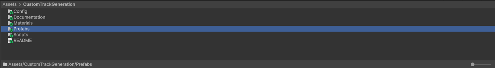
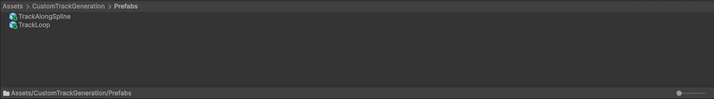
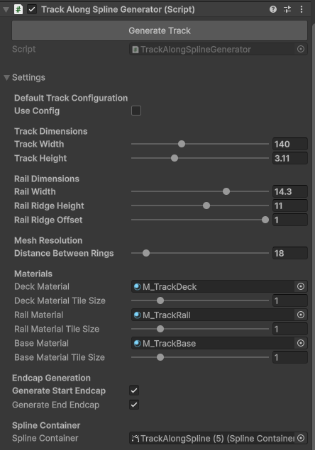
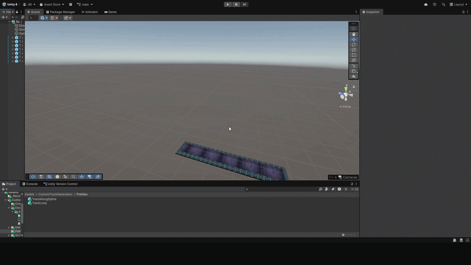
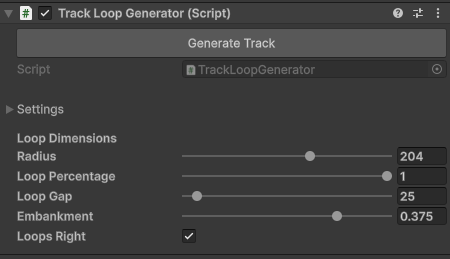
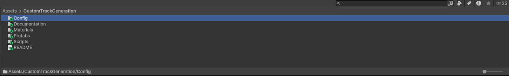
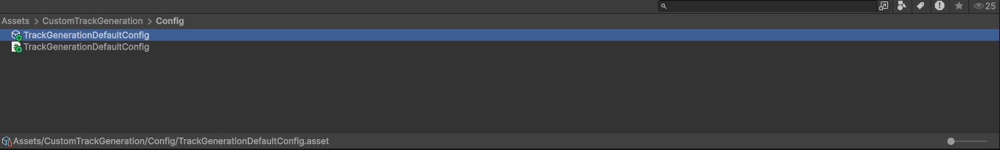
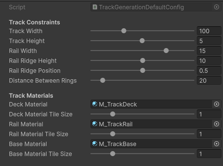

# Unity Custom Track Generation

## Rapid Custom Track Prototyping

Design and connect modular track pieces in seconds -> no manual alignment, no cleanup, no friction

---

## Description

This Unity tool enables developers to rapidly prototype and build game-ready track systems with full control over geometry, materials, and structure.

Track components are created procedurally using spline traversal and vector-based calculations to drive custom mesh generation with user-defined geometry. A centralized ScriptableObject stores default track geometry parameters to ensure consistent styling across all components, while still allowing customization of individual track components as needed.

To streamline the workflow, track pieces automatically snap together in the editor when placed near valid connection points. Endcaps are dynamically removed upon connection and restored when components are separated, eliminating the need for manual cleanup.

---

## Features

- **Automatic snapping between track components**  
- **Dynamic deletion and restoration of track endcaps**  
- **Track generation along user-defined spline components**  
- **Customizable track loops**  
- **Global configuration via ScriptableObject for consistency and modularity**  
- **Per-component customization for flexible design**  
- **Procedural mesh generation for parameter-defined track geometry**  

---

## What's Next?

In the near future, additional tools will be implemented, including:

- Curves  
- Ramps  
- Intersections  
- Tunnels  
- ... and more  

---

## License

**© 2026 James McAdams — All Rights Reserved.**  
This project is **proprietary** and **not open source**.

You may view this code for evaluation or portfolio-review purposes, but you may **not** copy, modify, use, or distribute any part of it without explicit written permission.

---

## Creator

**James McAdams (2026)**

---

## Documentation

### How would a developer use this tool?

---

## Prefabs

Navigate to the **Prefabs** folder and drag-and-drop track components directly into the scene.

The folder currently includes two prefabs:
- **TrackAlongSpline**
- **TrackLoop**

Both can be placed directly into the scene and configured through the Inspector.

---

## Track Along Spline

Define track layouts using spline control points, then procedurally generate fully customizable track geometry along the path.

When *Use Config* is disabled, track and rail geometry can be fully customized per component. Mesh resolution and materials can also be adjusted to match the style of any project.

---

## Track Loop

Quickly generate loop structures and seamlessly integrate them into existing track systems with fully customizable loop geometry.

Adjust loop parameters including:
- Radius  
- Gap between rising and falling segments  
- Loop percentage  
- Track roll  
- Direction  

---

## Global Settings Configuration

Navigate to the **Config** folder to define global track geometry and material settings.

Click on the **TrackGenerationDefaultConfig** ScriptableObject and look in the Inspector to view current default track configuration settings.

Any changes made to these parameters will be referenced by all track components. When *Use Config* is enabled and *Generate Track* is pressed, these settings drive the component’s generation. Use this system to maintain a consistent style across all track components.

---

## Additional Details

For a detailed breakdown of system architecture and implementation, see:  
`Documentation/TrackGenerationArchitecture.md`